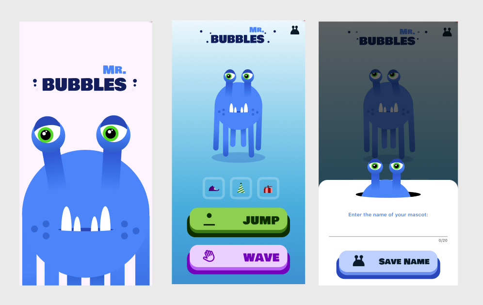

# Animations with Rive and Flutter Video Series (Companion App)

Hello! Welcome to Animations With Rive and Flutter - the series!

Video Series => [YouTube](https://www.youtube.com/playlist?list=PL8NTBhIXP2gERbpgjibkJwHBfCPi7GOAs)

Subscribe to the channel => [RomanJustCodes](https://www.youtube.com/@romanjustcodes)

This is the companion app that we developed during the video series, which covers all topics in the series:

- Introduction to the Rive Editor
- Your First Animation
- Creating and Importing Assets
- Artboards and Nested Artboards
- All About Inputs and Listeners
- Trigger Rive Animations Via Flutter
- Change Text in Rive Via Flutter
- Rive Performance in Flutter

If you find any issues running this project, please send me feedback in the form of an issue so I can address it accordingly.

Let's connect!
- On [LinkedIn](https://www.linkedin.com/in/roman-jaquez-8941a424/)
- On [Bluesky](https://bsky.app/profile/romanjaquez.bsky.social)
- On [X](https://x.com/drcoderz)

Thank  you for your support!